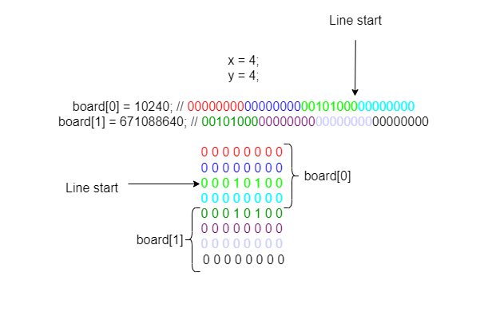

# Optimized checkers

Dorim sa optimizam reprezentarea suprafetei de joc de la Task 4 astfel incat sa ocupam mai putina memorie si calculele pozitiilor sa se faca mai rapid.

O posibila optimizare este reprezentata de notiunea de "Bitboard". "Bitboard" reprezinta o structura de date binara in care fiecare bit reprezinta prezenta sau absenta unei piese pe o anumita pozitie a tablei de joc. De obicei, in C, pentru a reprezenta un bitboard, se foloseste o variabila de tip 'unsigned long long'.
'unsigned long long' este un tip de date ce contine 64 biti (8 octeti). O table de joc de dimensiunea 8x8 poate fi reprezentata intuitiv cu o singura variabila de acest tip, grupand, la nivel logic, cate 8 biti pentru fiecare linie din suprafata. Din pacate insa, noi nu avem acces la registri pe 64 biti in cadrul cursului, astfel incat trebuie folositi 2 registri pentru reprezentarea suprafetei de joc.

`x - coloana pe care se afla piesa a carei pozitii vrem sa o calculam`

`y - linia pe care se afla piesa a carei pozitii vrem sa o calculam`

`board - doua numere intregi ce reprezinta suprafata de joc. Primul numar reprezinta partea superioara a suprafetei, pe cand al doilea numar reprezinta partea inferioara.`

Exemplu:

