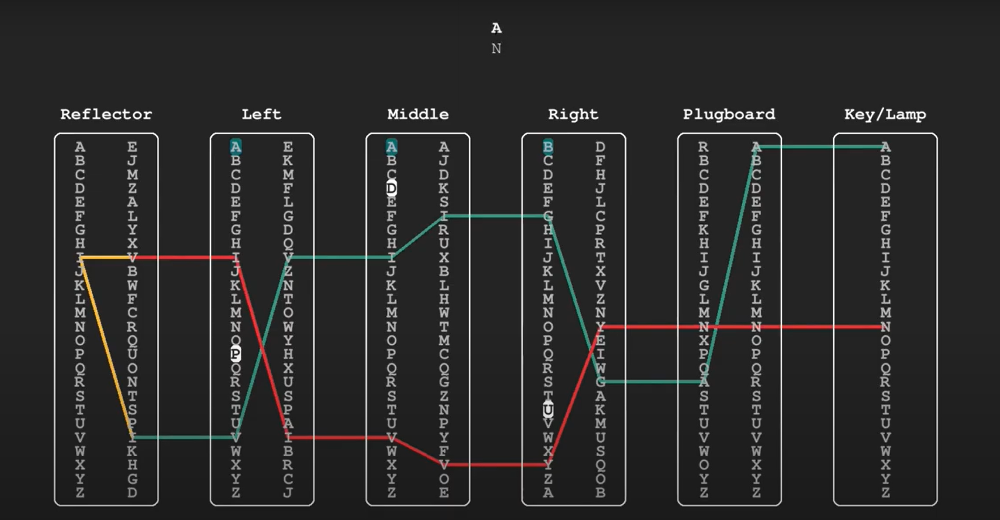

# ENIGMA MACHINE

Enigma machine este o masina de criptare complexa folosita de germani
in al 2-lea razboi mondial pentru a encoda mesaje. Aceasta este alca-
tuita din mai multe componente: \
`1. Plugboard : o placa fizica care face swap intre anumite litere.`

`2. Reflector : o placa fizica care face swap intre litere 2 cate 2.` \
De exemplu, daca A este legat la D, atunci D -> (reflector) -> A si
A -> (reflector) -> D.

`3. Rotor : o roata mecanica ce contine o permutare a celor 26 de litere
ale alfabetului, si un notch care are ca rol rotirea rotii din stanga.` \
Exemplu : Pentru Rotor1 avem \
A B C D E F G H I J K L M N O P Q R S T U V W X Y Z \
E K M F L G D Q V Z N T O W Y H X U S P A I B R C J, \
cu notch pe Q.

Vrem sa construim logica din spatele masinii enigma pentru a putea encripta
si decripta mesaje.
Configuratia masinii este stocata intr-o matrice config[10][26] astfel :
- liniile 0 - 1 reprezinta configuratia primului rotor.
- liniile 2 - 3 reprezinta configuratia celui de-al doilea rotor.
- liniile 4 - 5 reprezinta configuratia celui de-al treilea rotor.
- liniile 6 - 7 reprezinta configuratia reflector-ului.
- liniile 8 - 9 reprezinta configuratia plugboard-ului.

## a) Punerea rotorilor in pozitia initiala (5p):

Pentru rezolvarea acestui task aveti de implementat urmatoarea functie: \
`void rotate_x_positions(int x, int rotor, char config[10][26], int forward)`

unde:

`x - offset-ul noii pozitii`

`rotor - rotorul pe care se aplica rotatia (indexarea se face de la 0 !)`

`config - configuratia masinii pe care va trebui sa o modificati`

`forward - directia de rotatie` (daca forward = 0 atunci se shifteaza la stanga
x pozitii, daca forward = 1 atunci se shifteaza la dreapta x pozitii).

Se va modifica matricea config conform parametrului rotor.

Exemplu: \
Daca primele 2 linii din matricea config contin configuratia primului rotor, de exemplu \
A B C D E F G H I J K L M N O P Q R S T U V W X Y Z \
E K M F L G D Q V Z N T O W Y H X U S P A I B R C J \
si aplicam functia astfel: \
rotate_x_positions(3, 0, config, 0), atunci se modifica aceste 2 linii in \
D E F G H I J K L M N O P Q R S T U V W X Y Z A B C \
F L G D Q V Z N T O W Y H X U S P A I B R C J E K M 

## b) Codificarea mesajului (20p):
Pentru rezolvarea acestui task aveti de implementat urmatoarea functie: \
`void enigma(char *plain, char key[3], char notches[3], char config[10][26], char *enc)`

unde:

`plain - textul de criptat`

`key - pozitiile initiale ale rotorilor (key[i] = pozitia initiala a rotorului i)`

`notches - notch-urile initiale ale rotorilor (notches[i] = notch-ul initial a rotorului i)`

`config - configuratia masinii`

`enc - adresa la care va trebui sa scrieti textul criptat`

Atentie : inainte de citirea caracterului din plain, trebuie rotit al 3-lea rotor
cu 1 pozitie (shiftare la stanga) si incrementata pozitia initiala a acestuia (alfabetul
este circular deci daca incrementam Z acesta devine A). Daca pozitia curenta 
INAINTE DE ROTIRE a rotorului este egala cu notch-ul acestuia, atunci vom roti si
rotorul din stanga acestuia cu 1 pozitie (acest lucru se va realiza pentru toti
rotorii mai putin primul);

Exemplu 1 : key = "QWE", notches = "AAE" => key = "QXF"

Exemplu 2 : key = "QWE", notches = "AWE" => key = "RXF"

## Exemplu de encriptare al unui caracter:

