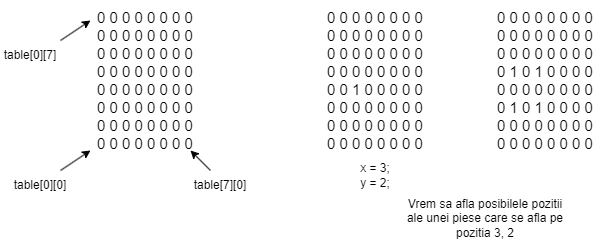

# Checkers

Vrem sa simulam jocul de checkers (dame).

Avem o matrice de 8x8 ce reprezinta suprafata de joc.

Dandu-se pozitie unei dame pe suprafata de joc, dorim sa calculam noi pozitii pe care poate ajunge aceasta.

Argumentele primite sunt:

`x - linia pe care se afla piesa a carei pozitii vrem sa o calculam`

`y - coloana pe care se afla piesa a carei pozitii vrem sa o calculam`

`table - tabla de joc unde se vor pune pozitiile pe care poate ajunge piesa de joc`

# ATENTIE:

Nu vor exista coliziuni intre piesele de joc. Presupunem ca pe tabla de joc se afla o singura piesa.

Piesele nu pot sa iasa din suprafata de joc.

# Exemplu:

