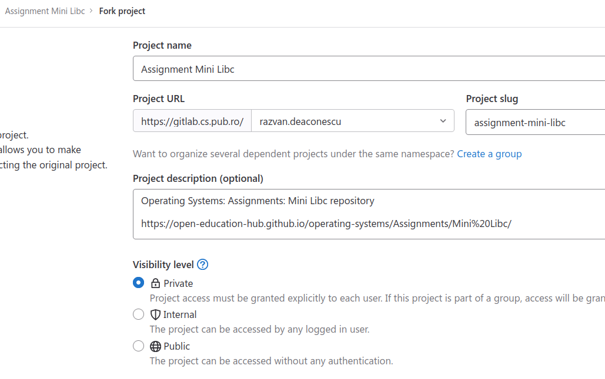
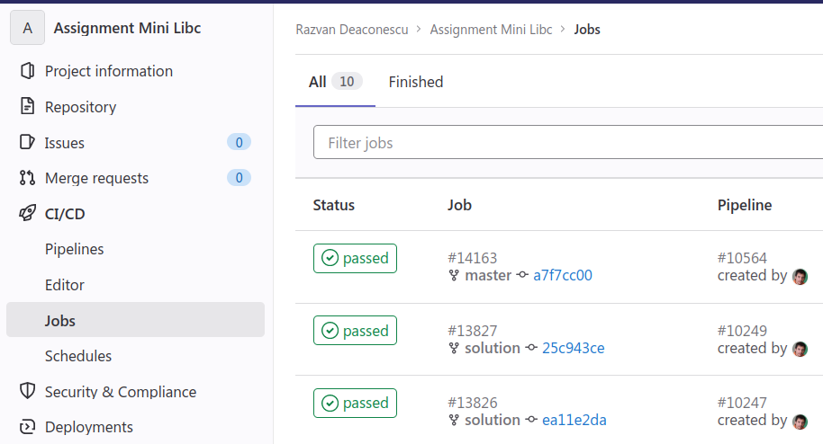

# Using the Checker

Use the automated infrastructure to check and grade the assignment.
This uses a Docker container to build the solution and to build and run the tests.
Using a Docker container provides two benefits:

1. it uses a given stable setup;
   no need to worry about different versions

1. it provides an isolated environment that can be easily created and destroyed

The Docker container and the checking can be done:

- **locally**, through the use of the `local.sh` script
- **remote** using GitLab pipelines, by doing a push in the remote repository

Entries in the repository:

- `checker/`: the high-level checker script (`checker.sh`)
- `tests/`: actual tests used to grade the assignment, called by `checker.sh`
- `src/`: initial assignment skeleton that is to be filled with the solution
- `Dockerfile`: used to construct the container used to build and test the assignment
- `local.sh`: script for local management of the Docker container, also for pushing it to the remote registry
- `CPPLINT.cfg`, `.shellcheckrc`, `.checkpatch.conf`: linter configuration files

Full instructions on using the checker are part of the [VMChecker Student Handbook](https://github.com/systems-cs-pub-ro/vmchecker-next/wiki/Student-Handbook).

## Setting Up

In order to set up the repository, do the following:

1. Login into your GitLab account using the UPB login at https://gitlab.cs.pub.ro/users/sign_in

1. Make a **private** fork of this repository.
   In the right corner you can find the fork button.
   After clicking it, a prompt similar to the one below will be offered:

   

   Select your user as the namespace for your fork.
   Make sure the visibility level is set to **Private**.
   Note that the image above is a sample for user `razvan.deaconescu` and for repository `assignment-mini-libc`.
   Adapt it to your needs.

1. Clone the repository locally:

   ```
   $ git clone <remote_of_your_private_fork>
   ```

Now you can work on the assignment and then test it.

## Working on the Assignment

To work on the assignment follow the instructions in `README.md`.
You need to enter the `src/` directory and update the source code files.

While working on the assignment, run the checker to see if certain tests work, and they are graded.

Do frequent Git commits with your changes to make sure you have a history of your work.

## Local Checker

For a local run, you need to have Docker installed.
See instructions [here](https://docs.docker.com/engine/install/).

To run the checker locally inside a Docker container, use the `local.sh` script.

First, build the container:

```console
$ ./local.sh docker build
[2023-03-28T19:59:52] [INFO] Building Docker image...
[...]
Successfully tagged gitlab.cs.pub.ro:5050/operating-systems/assignment-[...]:latest
```

And now run the checker inside the container:

```console
$ ./local.sh checker
```

Note that checking typically consists of two steps:

1. Run the actual tests in the `tests/` directory and grade the assignment.

1. Run linter steps on the solution (and tests) and provide an output.
   For maximum grade, assignments must remove all warnings and errors from linters.

## Remote Checker

To use the remote checker, push your changes into your fork.
Each time you do a fork, a remote GitLab pipeline will run a checker job.

Visit the fork on the [GitLab web interface](https://github.cs.pub.ro).
Access the `CI/CD -> Jobs` entry in the left menu.
You would get a view such as the one in the image below:



Click on the status of the job to see the run results.
The results are the ones you get with the local checker: a checker output and a linter output.

Each time you do a push, a new job will be created.

## Moodle Submission and Grading

To grade the assignment, it must through pass through [Moodle](https://curs.upb.ro).
This can be done through either a direct submission through Moodle or by picking up pushed content in the fork.

After this is done, the results of the submission will be available as feedback comments on Moodle.
Also, the grade from the submission will be made available on Moodle.

Results in Moodle are presented similar to the image below:


### Direct Moodle Submission

A direct Moodle submission will use the Moodle interface to submit an archive.

For this:

1. Create an archive.
   Do this by entering the `src/` directory and running:

   ```console
   $ make pack
   ```

   A file called `src.zip` will be created in the repository root (the parent directory of `src/`).

1. Access the assignment submission entry on Moodle and submit the archive there.
   After submitting, a GitLab run will be triggered with VMChecker.
   In a matter of minutes, results and grade will be available.

### Pushed Content Pickup

You can also directly pick up the results of a Git push submission using Moodle.

For this, you would have to use the Moodle block for the assignment, as instructed [here](https://github.com/systems-cs-pub-ro/vmchecker-next/wiki/Student-Handbook#32-submitting-an-assignment).

You need to fill the items:

- `Access token`: [Generate a personal access token](https://docs.gitlab.com/ee/user/profile/personal_access_tokens.html#create-a-personal-access-token)
- `Project ID`: the ID of the project in GitLab
- `Branch`: the Git branch that was used and pushed on the GitLab fork

After filling the items and submitting, a GitLab job will be stared and, then, the results will be made available on Moodle.


Recall that full instructions on using the checker are part of the [VMChecker Student Handbook](https://github.com/systems-cs-pub-ro/vmchecker-next/wiki/Student-Handbook).
